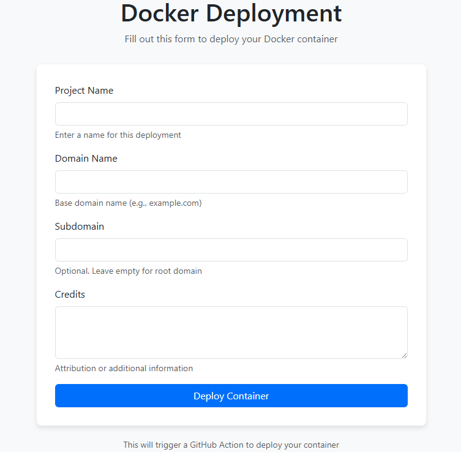

Docker Deployment Form System
This project provides a web-based form that triggers GitHub Actions to deploy Docker containers to cPanel hosting with custom domain/subdomain configurations using Nginx.

Features

Web form for submitting deployment details
Automated GitHub Actions workflow triggering
Dynamic domain/subdomain creation in cPanel
Docker container deployment
Nginx reverse proxy configuration
Secure authentication and logging

Prerequisites

Node.js (v14+) and npm
GitHub account with repository access
cPanel hosting with SSH access
Docker installed on the cPanel server
Nginx installed on the cPanel server

Installation

Clone this repository:
git clone https://github.com/yourusername/docker-deployment-form.git
cd docker-deployment-form

Install dependencies:
npm install

Create a .env file based on the provided sample:
cp .env.example .env

Update the .env file with your specific configuration.
Create the GitHub Actions workflow file:
mkdir -p .github/workflows
cp deploy.yml.example .github/workflows/deploy.yml

Set up GitHub repository secrets:

CPANEL_HOST
CPANEL_USERNAME
CPANEL_SSH_KEY (private key for SSH authentication)
CPANEL_SSH_PORT
DOCKER_IMAGE

Project Structure
docker-deployment-form/
├── .env                      # Environment configuration
├── .github/
│   └── workflows/
│       └── deploy.yml        # GitHub Actions workflow
├── public/
│   └── index.html            # Deployment form HTML
├── cpanel-deploy.sh          # cPanel deployment script
├── server.js                 # Node.js server application
├── package.json              # Node.js dependencies
└── README.md                 # Documentation
How It Works

User fills out the deployment form with:

Project name
Domain name
Subdomain (optional)
Credits/attribution

Form submission triggers the Node.js backend which:

Validates the input
Triggers GitHub Actions workflow via GitHub API

GitHub Actions workflow:

Creates Nginx configuration files
Transfers files to cPanel server
Executes deployment script

Deployment script on cPanel server:

Creates domain/subdomain in cPanel
Pulls the Docker image
Runs the container on an available port
Configures Nginx as a reverse proxy
Validates the deployment

Site is now live at the specified domain/subdomain

Security Considerations

Use HTTPS for the form submission
Implement rate limiting to prevent abuse
Store sensitive credentials securely (not in the repository)
Use minimal permissions for GitHub PAT
Validate form inputs to prevent injection attacks
Implement user authentication for the deployment form

Customization

Modify public/index.html to change the form layout
Update the GitHub Actions workflow for additional deployment steps
Extend the cPanel deployment script for your specific hosting environment

Troubleshooting

Check GitHub Actions logs for deployment errors
Verify cPanel API credentials
Ensure Docker and Nginx are properly installed on the cPanel server
Check server logs for container startup issues
Verify domain DNS is properly configured

License
MIT